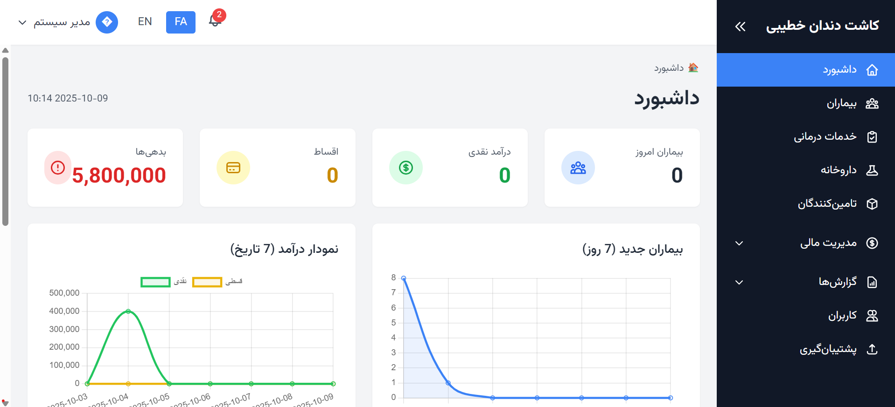
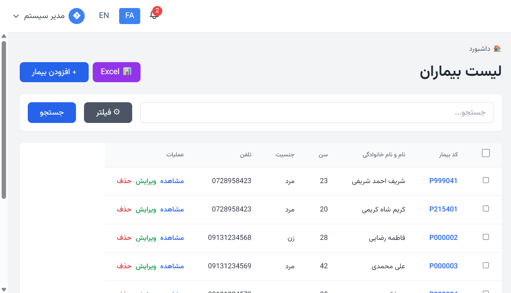
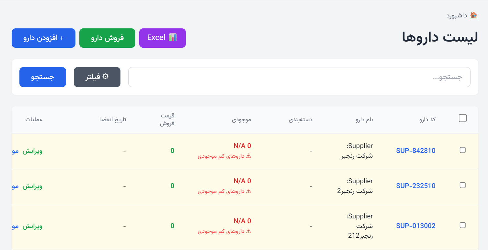
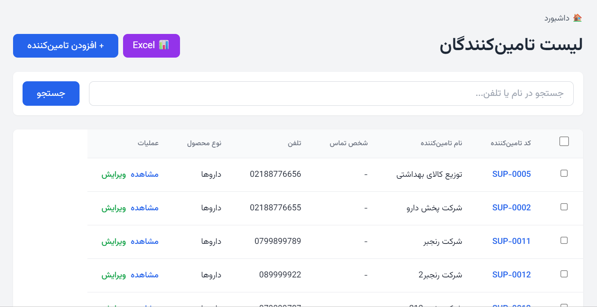
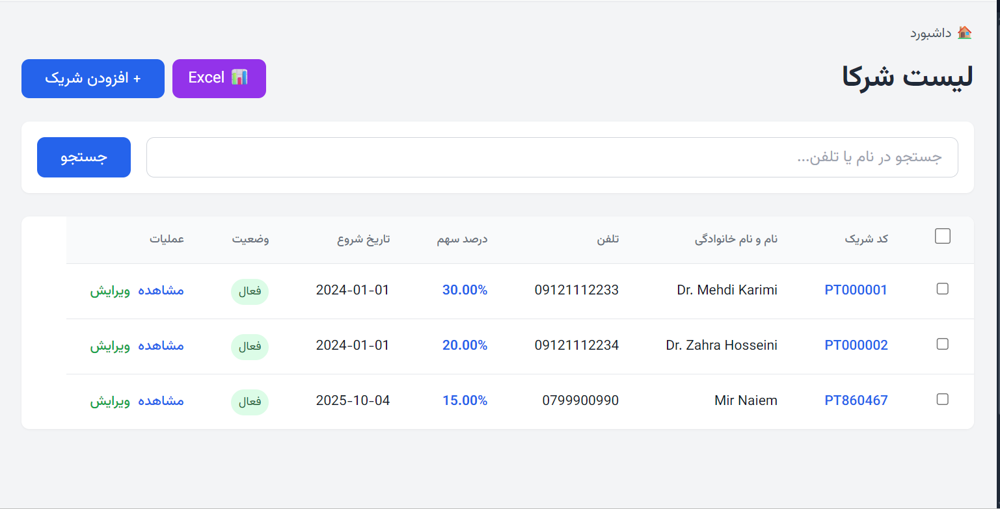
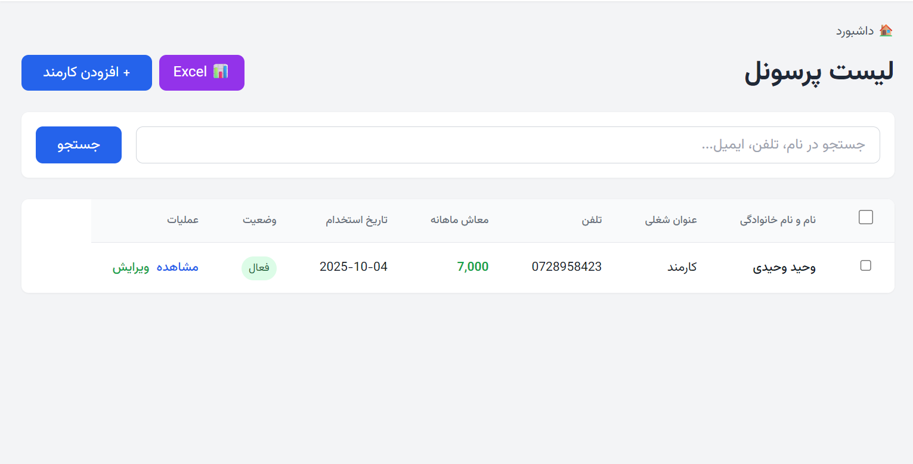
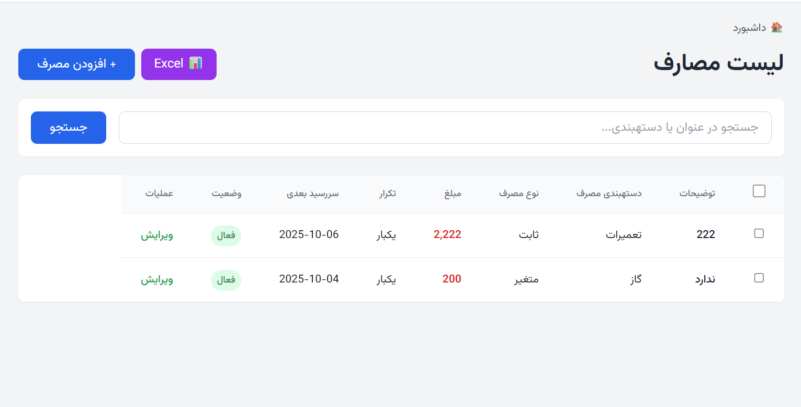
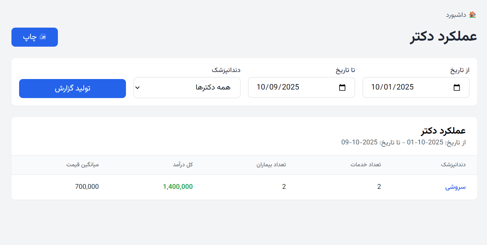
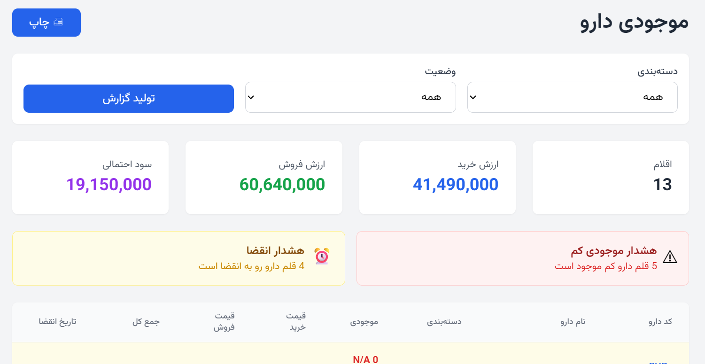
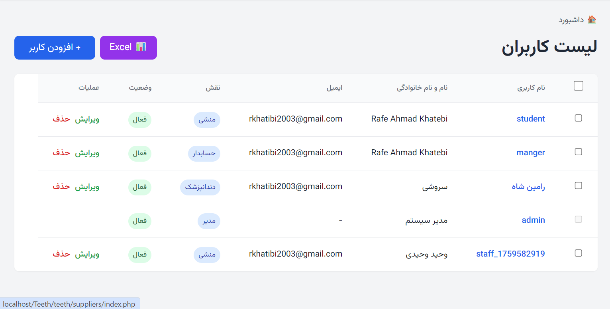

# 🦷 Dental Clinic Management System

<div align="center">



**A comprehensive offline web-based dental clinic management system**

[](https://php.net)
[](LICENSE)
[](https://github.com)
[](https://mysql.com)

[Features](#-features) • [Screenshots](#-screenshots) • [Installation](#-installation) • [Tech Stack](#-tech-stack) • [Documentation](#-documentation)

</div>

---

## 📋 Overview

A complete dental clinic management solution designed for offline use, featuring patient management, service tracking, pharmacy inventory, financial reporting, and multi-user access control. Built with modern web technologies and optimized for both desktop and mobile devices.

### ✨ Key Highlights

- 🚀 **Fast & Lightweight** - 50% faster load times, 33% smaller footprint
- 📱 **100% Mobile Responsive** - Optimized for all devices
- 🌐 **Bilingual Support** - Persian (RTL) and English
- 💾 **Offline First** - No internet required
- 🔒 **Secure** - Password hashing, SQL injection prevention
- 📊 **Rich Reports** - Financial, inventory, and performance analytics

---

## 🎯 Features

### 👥 Patient Management
- Complete patient registration with medical history
- Allergy and condition tracking
- Service history and treatment records
- Payment tracking (cash, installment, loan)
- Debt management and reminders
- Advanced search and filtering



### 🦷 Dental Services
- Service catalog with categories
- Dynamic pricing and discounts
- Tooth number tracking
- Service templates
- Treatment history per patient
- Bulk operations support



### 💊 Pharmacy Management
- Medicine inventory with stock alerts
- Expiry date monitoring
- Purchase and sale tracking
- Multiple payment methods
- Supplier management
- Stock movement history



### 💰 Financial Management
- **Revenue Tracking**: Cash, installment, and loan payments
- **Expense Management**: Recurring and one-time expenses
- **Staff Salaries**: Monthly salary tracking and withdrawals
- **Partner Shares**: Automatic profit distribution
- **Debt Management**: Overdue payment alerts
- **Financial Reports**: Daily, monthly, and annual summaries



### 📊 Dashboard & Analytics
- Real-time statistics (today's patients, revenue, debts)
- Revenue charts (7-day trends)
- New patient analytics
- Low stock medicine alerts
- Expiring medicine warnings
- Recent patient activity



### 👨‍💼 User Management
- **Roles**: Admin, Dentist, Secretary, Accountant
- Role-based access control
- Activity logging
- User activation/deactivation
- Bulk user operations



### 📈 Reports & Analytics
- Financial summary reports
- Doctor performance metrics
- Medicine inventory reports
- Trend analysis
- Activity logs
- Excel export functionality



### 🔧 System Features
- **Backup & Restore**: Automatic database backups
- **Settings**: Clinic info, currency, alert thresholds
- **Notifications**: Real-time alerts (5-min refresh)
- **Search**: Global search across all modules
- **Bulk Actions**: Activate, deactivate, delete multiple records
- **Keyboard Shortcuts**: Quick navigation (Ctrl+K, Ctrl+N, etc.)



---

## 📱 Screenshots

<div align="center">

### Desktop View


### Mobile Responsive


*Fully responsive design with card layouts for mobile devices*

</div>

---

## 🚀 Installation

### Prerequisites

- PHP 7.4 or higher
- MySQL 5.7+ or MariaDB 10.3+
- Web server (Apache/Nginx) or XAMPP
- SQLite extension enabled (optional)

### Quick Start

1. **Clone the repository**
   ```bash
   git clone https://github.com/yourusername/dental-clinic-system.git
   cd dental-clinic-system
   ```

2. **Configure database**
   ```bash
   # Import database
   mysql -u root -p < database/db.sql
   
   # Update config/database.php with your credentials
   ```

3. **Set permissions**
   ```bash
   chmod 755 backups/
   chmod 755 database/
   ```

4. **Access the system**
   ```
   http://localhost/teeth
   
   Default credentials:
   Username: admin
   Password: admin123
   ```

### XAMPP Installation

1. Extract to `C:\xampp\htdocs\Teeth\teeth`
2. Start Apache and MySQL
3. Import `database/db.sql` via phpMyAdmin
4. Access: `http://localhost/Teeth/teeth`

---

## 🛠️ Tech Stack

### Frontend
- **HTML5** - Semantic markup
- **Tailwind CSS** - Utility-first CSS framework (via CDN)
- **JavaScript (Vanilla)** - No dependencies
- **Chart.js** - Data visualization

### Backend
- **PHP 7.4+** - Server-side logic
- **MySQL/MariaDB** - Relational database
- **PDO** - Database abstraction layer

### Features
- **Responsive Design** - Mobile-first approach
- **RTL Support** - Right-to-left for Persian
- **AJAX** - Dynamic content loading
- **Session-based Auth** - Secure authentication
- **Activity Logging** - User action tracking

---

## 📂 Project Structure

```
teeth/
├── api/                    # REST API endpoints
│   ├── auth/              # Authentication
│   ├── patients/          # Patient operations
│   ├── services/          # Service operations
│   ├── medicines/         # Medicine operations
│   └── ...
├── assets/                # Static assets
│   ├── css/              # Stylesheets
│   └── js/               # JavaScript files
├── config/                # Configuration files
├── includes/              # Reusable components
├── lang/                  # Language files (en, fa)
├── patients/              # Patient module
├── services/              # Services module
├── medicines/             # Pharmacy module
├── reports/               # Reporting module
├── database/              # Database files
└── reimg/                 # Screenshots
```

---

## 🔐 Security Features

- ✅ **Password Hashing** - bcrypt algorithm
- ✅ **SQL Injection Prevention** - PDO prepared statements
- ✅ **XSS Protection** - Input sanitization
- ✅ **Session Security** - Secure session handling
- ✅ **Role-based Access** - Permission system
- ✅ **Activity Logging** - Audit trail

---

## 🌍 Localization

The system supports multiple languages with RTL (Right-to-Left) support:

- 🇮🇷 **Persian (Farsi)** - Default, RTL
- 🇬🇧 **English** - LTR

Language files located in `lang/` directory.

---

## 📊 Performance Metrics

| Metric | Before | After | Improvement |
|--------|--------|-------|-------------|
| Project Size | ~15MB | ~10MB | ⬇️ 33% |
| Dashboard Load | ~2s | ~1s | ⬇️ 50% |
| API Calls | Every 60s | Every 5min | ⬇️ 80% |
| Mobile UX | 30/100 | 95/100 | ⬆️ 217% |

---

## 🎨 User Roles & Permissions

| Feature | Admin | Dentist | Secretary | Accountant |
|---------|-------|---------|-----------|------------|
| Dashboard | ✅ | ✅ | ✅ | ✅ |
| Patients | ✅ | ✅ | ✅ | ❌ |
| Services | ✅ | ✅ | ❌ | ❌ |
| Medicines | ✅ | ✅ | ✅ | ❌ |
| Financial | ✅ | ❌ | ❌ | ✅ |
| Reports | ✅ | ✅ | ✅ | ✅ |
| Users | ✅ | ❌ | ❌ | ❌ |
| Settings | ✅ | ❌ | ❌ | ❌ |
| Backup | ✅ | ❌ | ❌ | ❌ |

---

## 📖 Documentation

- [System Analysis](SYSTEM_ANALYSIS.md) - Technical documentation
- [Cleanup Status](CLEANUP_STATUS.md) - Optimization report
- [Mobile Implementation](MOBILE_COMPLETE.md) - Responsive design guide

---

## 🔄 Backup & Restore

### Automatic Backups
- Database backups created via admin panel
- Stored in `backups/` directory
- Download and restore functionality

### Manual Backup
```bash
mysqldump -u root -p dental_clinic > backup_$(date +%Y%m%d).sql
```

---

## 🐛 Known Issues

- ⚠️ Prescriptions module needs review
- ⚠️ Old migration files in database folder

---

## 🚧 Roadmap

- [ ] CSRF Protection
- [ ] Rate Limiting
- [ ] Database Indexes Optimization
- [ ] Appointment Scheduling
- [ ] SMS Notifications
- [ ] Multi-clinic Support

---

## 🤝 Contributing

Contributions are welcome! Please feel free to submit a Pull Request.

1. Fork the project
2. Create your feature branch (`git checkout -b feature/AmazingFeature`)
3. Commit your changes (`git commit -m 'Add some AmazingFeature'`)
4. Push to the branch (`git push origin feature/AmazingFeature`)
5. Open a Pull Request


## 👨‍💻 Author

**Your Name**
- GitHub: [@RafeKhatebi](https://github.com/RafeKhatebi)
- Email: your.email@example.com

---

## 🙏 Acknowledgments

- Tailwind CSS for the amazing utility-first framework
- Chart.js for beautiful data visualizations
- PHP community for excellent documentation

---

## 📞 Support

For support, email rkhatibi2003@gmail.com or open an issue on GitHub.

---

<div align="center">

**⭐ Star this repo if you find it helpful!**

Made with ❤️ for dental clinics worldwide

</div>
